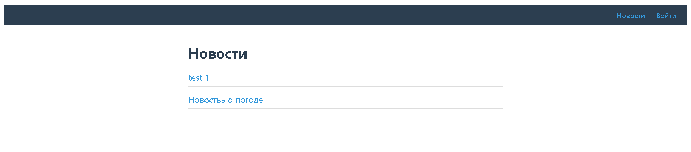
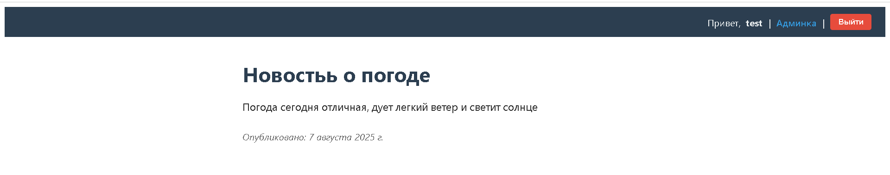
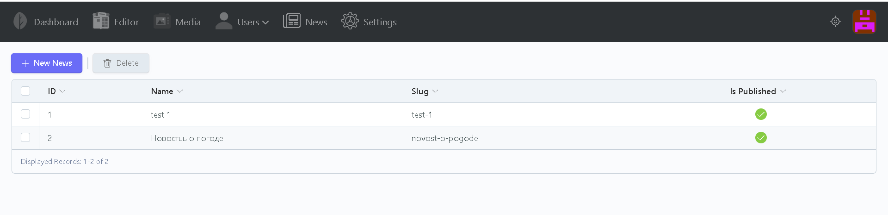
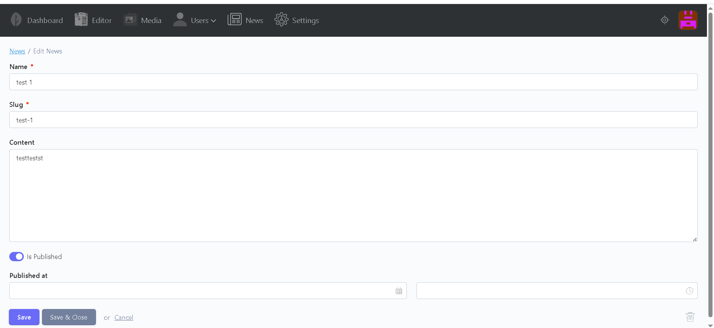
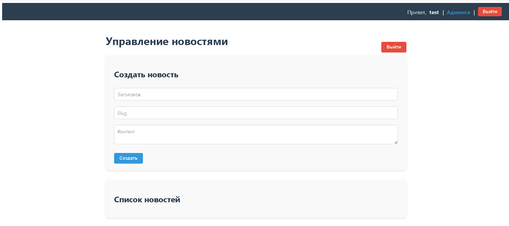

# News Project — October CMS + Vue.js (Pinia)

Небольшой модуль новостей с административной и публичной частями.  
Backend — October CMS с PostgreSQL, frontend — SPA на Vue 3 с Pinia и Vue Router.  
Взаимодействие через REST API.

---

## Оглавление

- [Описание проекта](#описание-проекта)
- [Технологии](#технологии)
- [Установка и запуск](#установка-и-запуск)
- [Использование](#использование)
- [API](#api)
- [Административная панель](#административная-панель)
- [Скриншоты](#скриншоты)
- [Контакты](#контакты)

---

## Описание проекта

Проект реализует CRUD для новостей в October CMS, предоставляя публичный API для просмотра опубликованных новостей и административный интерфейс для управления ими. Frontend — SPA на Vue 3, использующая Pinia для состояния и Vue Router для маршрутизации.

---

## Технологии

- Backend: October CMS (PHP 8.1, Apache)  
- База данных: PostgreSQL 15  
- Frontend: Vue 3, Pinia, Vue Router, Vite  
- Docker и docker-compose для локального запуска  

---

## Установка и запуск

Для запуска используйте ваш `docker-compose.yml` и соответствующие Dockerfile для backend и frontend.  
Контейнеры настроены на автоматический запуск миграций и запуск приложений.

---

## Использование

- Backend доступен по адресу: [http://localhost:8000](http://localhost:8000)  
- Админка October CMS: [http://localhost:8000/admin](http://localhost:8000/admin)  
- Frontend SPA: [http://localhost:5173](http://localhost:5173)  

---

## Административная панель

Для доступа к административной панели используйте URL `http://localhost:8000/admin`.  
Пользователя необходимо создать через UI админки October CMS либо вручную в базе данных.

---

## API

- `GET /api/news` — список опубликованных новостей  
- `GET /api/news/{slug}` — детальная информация о новости  
- `POST /api/news` — создание новости (только авторизованным)  
- `PUT /api/news/{id}` — обновление новости (только авторизованным)  
- `DELETE /api/news/{id}` — удаление новости (только авторизованным)  

---

## Скриншоты

### Главная страница (frontend)

### Страница новости (детальная) (frontend)

### Админка October CMS — список новостей

### Админка October CMS — редактор новости

### Админка Vue.js — редактор новости

---

## Контакты

По вопросам проекта пишите: [ваш_email@example.com]